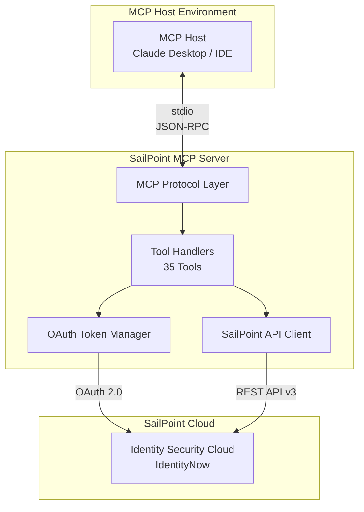

# SailPoint MCP Server - Architecture Documentation

This directory contains comprehensive architecture documentation for the SailPoint IdentityNow MCP (Model Context Protocol) Server.

## Overview

The SailPoint MCP Server is an integration layer that exposes SailPoint Identity Security Cloud (IdentityNow) capabilities through the Model Context Protocol, enabling AI assistants and automation tools to interact with enterprise identity governance functions.

## Document Index

| Document | Description |
|----------|-------------|
| [Context](./context.md) | C4 Level 1 - System context and external dependencies |
| [Containers](./containers.md) | C4 Level 2 - Container architecture and runtime boundaries |
| [Components](./components.md) | C4 Level 3 - Internal component design and responsibilities |
| [Deployment](./deployment.md) | Deployment views across environments |
| [Data Flows](./data-flows.md) | Data flow diagrams and sensitive data paths |
| [Security](./security.md) | Threat model, controls, and security architecture |
| [TOGAF Mapping](./togaf-mapping.md) | TOGAF-aligned architecture views |
| [Decisions](./decisions.md) | Architecture Decision Records (ADRs) |

## Quick Reference

### Technology Stack

- **Runtime**: Node.js (ES2022+)
- **Language**: TypeScript 5.3+
- **Protocol**: Model Context Protocol (MCP) over stdio
- **External API**: SailPoint IdentityNow REST API v3
- **Authentication**: OAuth 2.0 Client Credentials Flow

### Key Characteristics

| Dimension | Summary |
|-----------|---------|
| **Architecture Style** | Single-process CLI application with MCP protocol |
| **Deployment Model** | Local process, typically spawned by MCP host |
| **Scalability** | Single tenant, single instance per session |
| **Security Boundary** | Client credentials with delegated SailPoint permissions |
| **Data Classification** | Handles PII and sensitive identity/access data |

### Available Tool Categories

| Category | Tools | Description |
|----------|-------|-------------|
| Identities | 2 | List and retrieve identity information |
| Accounts | 5 | Account lifecycle and entitlement management |
| Access Profiles | 3 | Access profile CRUD operations |
| Roles | 4 | Role management and assignment |
| Certifications | 4 | Access review campaigns |
| Workflows | 4 | Automation workflow operations |
| Sources | 2 | Connected system management |
| Search | 2 | Full-text and aggregate search |
| Entitlements | 2 | Entitlement management |
| Access Requests | 2 | Access request lifecycle |
| Identity Profiles | 2 | Identity profile configuration |
| SOD Policies | 3 | Separation of Duties compliance |

## Architecture Diagram Overview

## Getting Started

1. Review the [Context](./context.md) document to understand the system boundaries
2. Examine [Security](./security.md) for threat model and controls
3. Check [Deployment](./deployment.md) for environment setup
4. Reference [Decisions](./decisions.md) for architectural rationale

## Versioning

| Version | Date | Author | Changes |
|---------|------|--------|---------|
| 1.0.0 | 2025-01-16 | Architecture Team | Initial documentation |

---

*Generated for SailPoint MCP Server v1.0.0*
