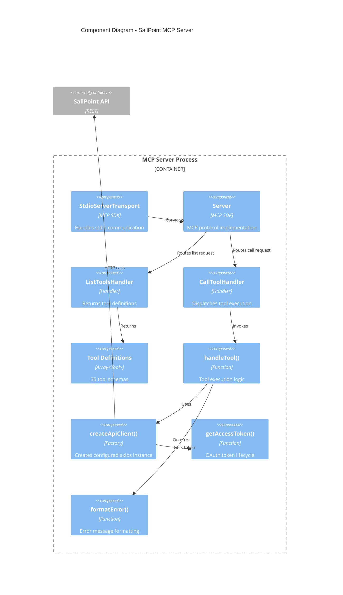
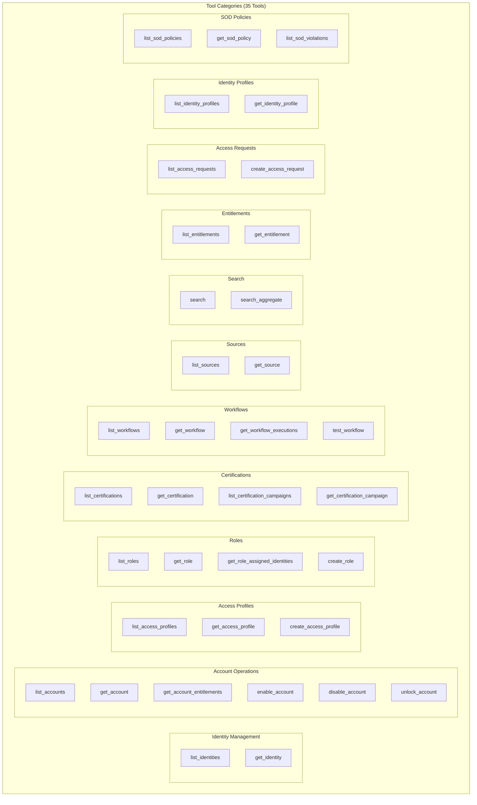
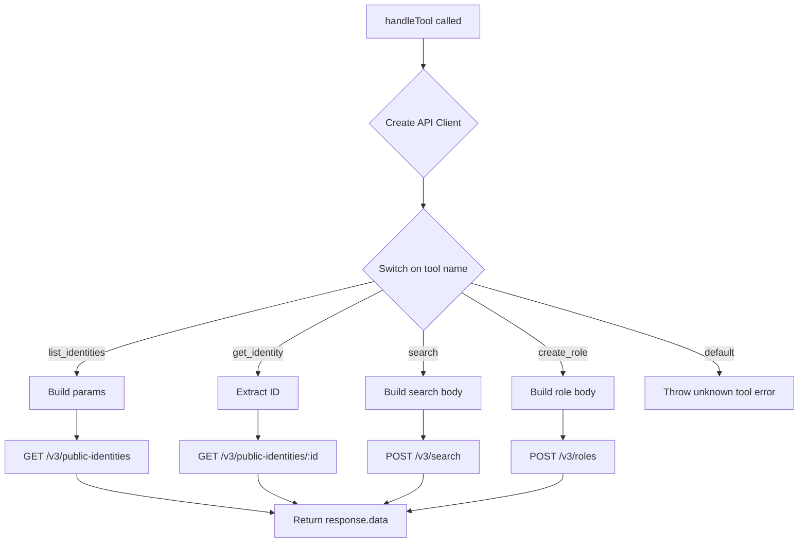
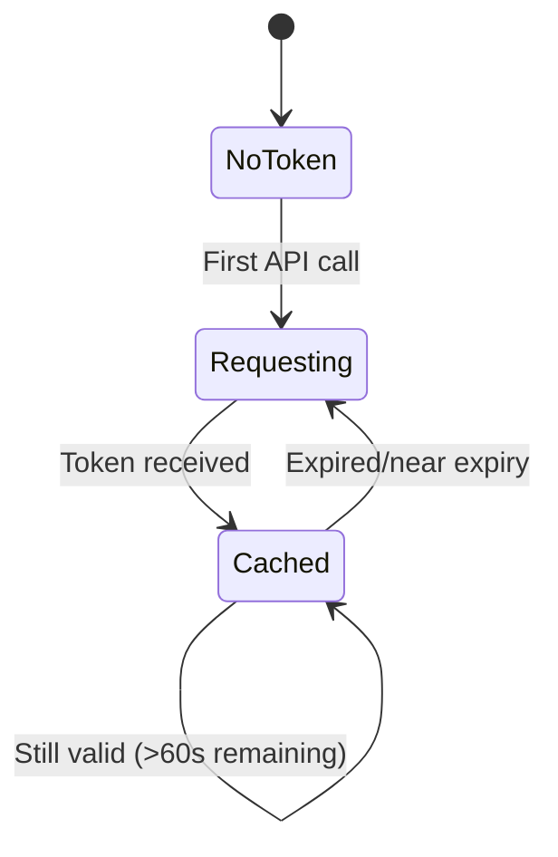
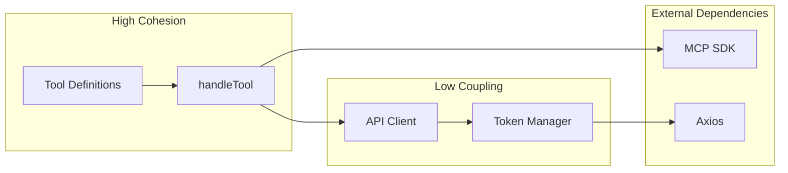

# Component Architecture (C4 Level 3)

This document describes the internal component architecture of the SailPoint MCP Server, detailing the responsibilities and interactions of each module.

## Component Diagram



## Component Details

### Transport Layer

#### StdioServerTransport

**Source**: `@modelcontextprotocol/sdk/server/stdio.js`

```typescript
const transport = new StdioServerTransport();
await server.connect(transport);
```

| Aspect | Description |
|--------|-------------|
| **Responsibility** | Reads from stdin, writes to stdout |
| **Protocol** | Newline-delimited JSON-RPC 2.0 |
| **Error Handling** | Surfaces transport errors to server |
| **Lifecycle** | Created once, persists for process lifetime |

### Protocol Layer

#### Server (MCP Server Core)

**Source**: `@modelcontextprotocol/sdk/server/index.js`

```typescript
const server = new Server(
  { name: "sailpoint-mcp", version: "1.0.0" },
  { capabilities: { tools: {} } }
);
```

| Aspect | Description |
|--------|-------------|
| **Responsibility** | Implements MCP protocol, routes requests to handlers |
| **Capabilities** | Declares `tools` capability |
| **Versioning** | Reports server name and version to host |
| **Request Routing** | Uses schema-based handler registration |

### Request Handlers

#### ListToolsHandler

```typescript
server.setRequestHandler(ListToolsRequestSchema, async () => {
  return { tools };
});
```

| Aspect | Description |
|--------|-------------|
| **Request** | `tools/list` |
| **Response** | Array of 35 tool definitions |
| **Caching** | Static response, defined at startup |

#### CallToolHandler

```typescript
server.setRequestHandler(CallToolRequestSchema, async (request) => {
  const { name, arguments: args } = request.params;
  const result = await handleTool(name, args);
  return { content: [{ type: "text", text: JSON.stringify(result) }] };
});
```

| Aspect | Description |
|--------|-------------|
| **Request** | `tools/call` with tool name and arguments |
| **Response** | Text content with JSON-stringified result |
| **Error Handling** | Returns `isError: true` on failure |

### Tool Definitions

The `tools` array contains 35 tool definitions organized by domain.



#### Tool Schema Structure

Each tool follows a consistent schema pattern:

```typescript
{
  name: string,           // Unique identifier
  description: string,    // Natural language description
  inputSchema: {
    type: "object",
    properties: { ... },  // Parameter definitions
    required?: string[]   // Required parameters
  }
}
```

### Business Logic

#### handleTool() Function

**Location**: Lines 924-1295 in `index.ts`

The central switch-based dispatcher for all tool operations.



**Pattern Analysis**:

| Operation Type | HTTP Method | Endpoints |
|----------------|-------------|-----------|
| List operations | GET | 12 endpoints |
| Get by ID | GET | 11 endpoints |
| Create/Execute | POST | 5 endpoints |
| Search | POST | 2 endpoints |

### Integration Layer

#### createApiClient() Factory

```typescript
const createApiClient = async (): Promise<AxiosInstance> => {
  const token = await getAccessToken();
  return axios.create({
    baseURL: SAILPOINT_BASE_URL,
    headers: {
      Authorization: `Bearer ${token}`,
      "Content-Type": "application/json",
    },
  });
};
```

| Aspect | Description |
|--------|-------------|
| **Returns** | Configured axios instance |
| **Base URL** | From `SAILPOINT_BASE_URL` environment variable |
| **Authentication** | Bearer token in Authorization header |
| **Content Type** | application/json |

#### getAccessToken() - Token Manager

```typescript
let accessToken: string | null = null;
let tokenExpiry: number = 0;

async function getAccessToken(): Promise<string> {
  const now = Date.now();

  // Return cached token if valid
  if (accessToken && tokenExpiry > now + 60000) {
    return accessToken;
  }

  // Request new token
  const response = await axios.post(tokenUrl, params);
  accessToken = response.data.access_token;
  tokenExpiry = now + response.data.expires_in * 1000;

  return accessToken;
}
```

**Token Lifecycle**:



| Aspect | Description |
|--------|-------------|
| **Grant Type** | client_credentials |
| **Cache** | In-memory, module-scoped |
| **Buffer** | 60 second pre-expiry refresh |
| **Default Expiry** | 720 seconds (12 minutes) if not specified |

#### formatError() - Error Formatter

```typescript
function formatError(error: unknown): string {
  if (axios.isAxiosError(error)) {
    const data = axiosError.response?.data;
    // Extract SailPoint error messages
    if (data?.messages) return data.messages.map(m => m.text).join("; ");
    if (data?.message) return `${data.detailCode}: ${data.message}`;
    return `HTTP ${status}: ${message}`;
  }
  return String(error);
}
```

| Error Source | Handling |
|--------------|----------|
| SailPoint API errors | Extracts structured error messages |
| HTTP errors | Reports status code and message |
| Generic errors | Converts to string |

## API Endpoint Mapping

### Read Operations

| Tool | HTTP Method | Endpoint |
|------|-------------|----------|
| `list_identities` | GET | `/v3/public-identities` |
| `get_identity` | GET | `/v3/public-identities/{id}` |
| `list_accounts` | GET | `/v3/accounts` |
| `get_account` | GET | `/v3/accounts/{id}` |
| `get_account_entitlements` | GET | `/v3/accounts/{id}/entitlements` |
| `list_access_profiles` | GET | `/v3/access-profiles` |
| `get_access_profile` | GET | `/v3/access-profiles/{id}` |
| `list_roles` | GET | `/v3/roles` |
| `get_role` | GET | `/v3/roles/{id}` |
| `get_role_assigned_identities` | GET | `/v3/roles/{id}/assigned-identities` |
| `list_certifications` | GET | `/v3/certifications` |
| `get_certification` | GET | `/v3/certifications/{id}` |
| `list_certification_campaigns` | GET | `/v3/campaigns` |
| `get_certification_campaign` | GET | `/v3/campaigns/{id}` |
| `list_workflows` | GET | `/v3/workflows` |
| `get_workflow` | GET | `/v3/workflows/{id}` |
| `get_workflow_executions` | GET | `/v3/workflows/{id}/executions` |
| `list_sources` | GET | `/v3/sources` |
| `get_source` | GET | `/v3/sources/{id}` |
| `list_entitlements` | GET | `/v3/entitlements` |
| `get_entitlement` | GET | `/v3/entitlements/{id}` |
| `list_access_requests` | GET | `/v3/access-requests` |
| `list_identity_profiles` | GET | `/v3/identity-profiles` |
| `get_identity_profile` | GET | `/v3/identity-profiles/{id}` |
| `list_sod_policies` | GET | `/v3/sod-policies` |
| `get_sod_policy` | GET | `/v3/sod-policies/{id}` |
| `list_sod_violations` | GET | `/v3/sod-violations/predicted` |

### Write Operations

| Tool | HTTP Method | Endpoint |
|------|-------------|----------|
| `create_access_profile` | POST | `/v3/access-profiles` |
| `create_role` | POST | `/v3/roles` |
| `create_access_request` | POST | `/v3/access-requests` |
| `enable_account` | POST | `/v3/accounts/{id}/enable` |
| `disable_account` | POST | `/v3/accounts/{id}/disable` |
| `unlock_account` | POST | `/v3/accounts/{id}/unlock` |
| `test_workflow` | POST | `/v3/workflows/{id}/test` |
| `search` | POST | `/v3/search` |
| `search_aggregate` | POST | `/v3/search/aggregate` |

## Component Coupling Analysis



| Coupling | Components | Mitigation |
|----------|------------|------------|
| **Tight** | handleTool + Tool Definitions | Co-located, same file |
| **Loose** | Token Manager + API Client | Functional composition |
| **External** | MCP SDK, Axios | Versioned dependencies |

## Open Questions and Gaps

1. **Tool Separation**: All 35 tools in single switch statement. Consider modular organization by domain.
2. **Input Validation**: No runtime validation of tool parameters beyond TypeScript types.
3. **Response Transformation**: Raw API responses passed through. Consider response normalization.
4. **Retry Logic**: No retry mechanism for transient API failures.
5. **Pagination Handling**: Caller must manage pagination manually. Consider auto-pagination option.
6. **Caching**: No response caching. Consider caching for frequently-accessed data.

---

*Next: [Deployment](./deployment.md) - Deployment views across environments*
