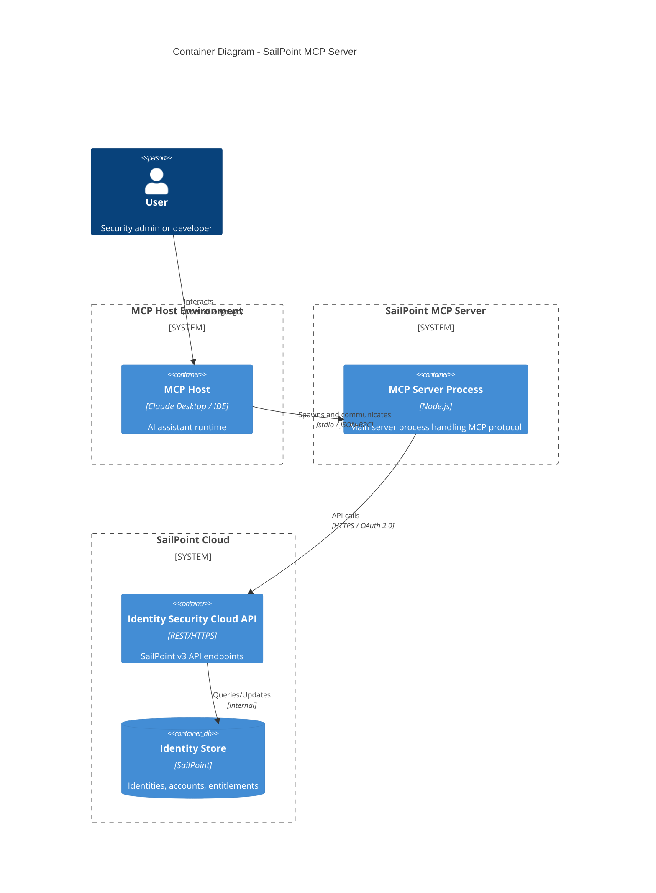
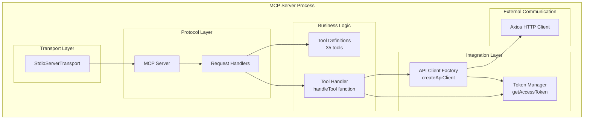
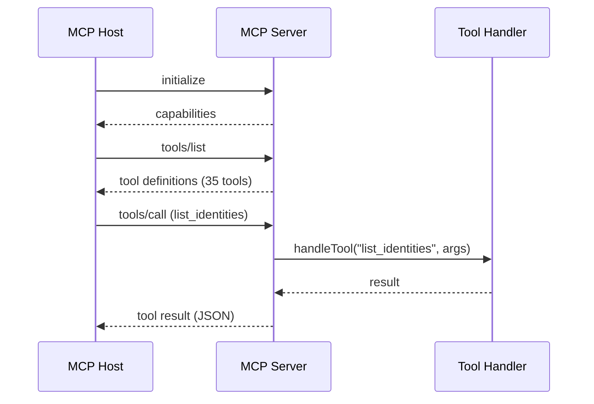
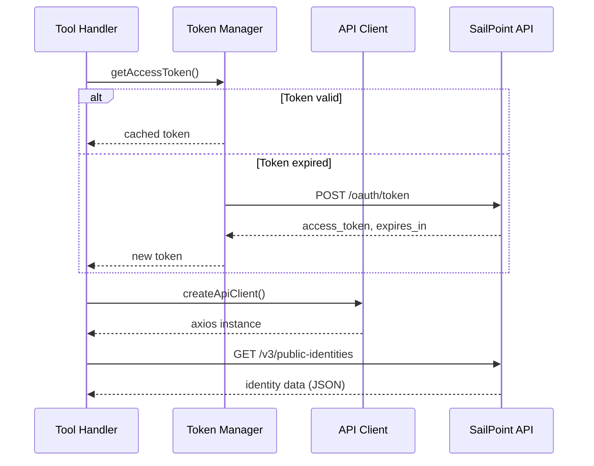
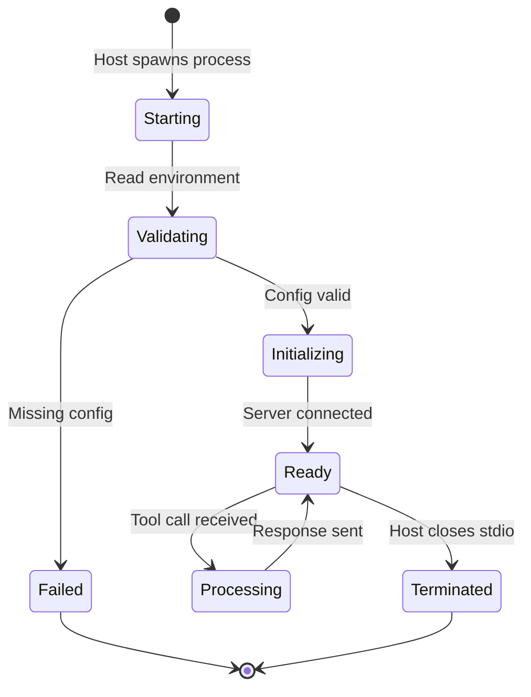

# Container Architecture (C4 Level 2)

This document describes the container-level architecture of the SailPoint MCP Server, showing the major runtime elements and their interactions.

## Container Diagram



## Container Details

### MCP Server Process

The single-process Node.js application that implements the Model Context Protocol server.



#### Runtime Characteristics

| Characteristic | Value |
|----------------|-------|
| **Runtime** | Node.js 18+ |
| **Module System** | ESM (ES Modules) |
| **Process Model** | Single process, single thread event loop |
| **Memory Footprint** | ~50-100MB typical |
| **Startup Time** | <1 second |
| **Lifecycle** | Managed by MCP host |

#### Key Dependencies

| Dependency | Version | Purpose |
|------------|---------|---------|
| `@modelcontextprotocol/sdk` | ^1.0.0 | MCP protocol implementation |
| `axios` | ^1.6.0 | HTTP client for SailPoint API |
| `typescript` | ^5.3.0 | Development toolchain |

### MCP Host (External Container)

The parent process that spawns and manages the MCP server.

| Aspect | Description |
|--------|-------------|
| **Examples** | Claude Desktop, VS Code extension, custom CLI |
| **Responsibility** | User interaction, credential management, process lifecycle |
| **Communication** | Spawns child process, communicates via stdio |
| **Trust Model** | Fully trusted, provides environment and credentials |

### SailPoint Identity Security Cloud (External)

The target identity governance platform.

| Aspect | Description |
|--------|-------------|
| **Deployment** | SaaS, multi-tenant cloud platform |
| **API Version** | v3 REST API |
| **Authentication** | OAuth 2.0 with PAT-based client credentials |
| **Rate Limiting** | Tenant-specific limits apply |

## Communication Protocols

### MCP Protocol (Inbound)



**Protocol Characteristics:**

| Aspect | Specification |
|--------|---------------|
| Transport | stdio (stdin/stdout) |
| Message Format | JSON-RPC 2.0 |
| Encoding | UTF-8 |
| Framing | Newline-delimited |
| Concurrency | Sequential (single request at a time) |

### SailPoint API (Outbound)



**API Characteristics:**

| Aspect | Specification |
|--------|---------------|
| Protocol | HTTPS (TLS 1.2+) |
| Authentication | Bearer token (OAuth 2.0) |
| Content Type | application/json |
| API Version | v3 |
| Rate Limiting | Tenant-specific |

## Process Boundaries

### Trust Boundary: Host <-> Server

```
┌─────────────────────────────────────┐
│ MCP Host (Trusted)                  │
│ - User authentication               │
│ - Credential storage                │
│ - Environment provisioning          │
├─────────────────────────────────────┤
│ ▼ stdio (JSON-RPC)                  │
├─────────────────────────────────────┤
│ MCP Server Process                  │
│ - Tool execution                    │
│ - API communication                 │
│ - Token management                  │
└─────────────────────────────────────┘
```

**Boundary Characteristics:**

- Host provides credentials via environment variables
- Server inherits file system access from host
- No additional sandboxing within server process
- All tool results pass back through host

### Trust Boundary: Server <-> SailPoint

```
┌─────────────────────────────────────┐
│ MCP Server (Internal)               │
│ - Constructs API requests           │
│ - Manages OAuth tokens              │
│ - Processes responses               │
├─────────────────────────────────────┤
│ ▼ HTTPS (OAuth 2.0 Bearer)          │
├─────────────────────────────────────┤
│ SailPoint Cloud (External)          │
│ - Validates tokens                  │
│ - Enforces authorization            │
│ - Returns identity data             │
└─────────────────────────────────────┘
```

**Boundary Characteristics:**

- All communication encrypted via TLS
- Token-based authentication (client credentials)
- Authorization delegated to SailPoint RBAC
- Response validation minimal (type safety only)

## Runtime Model

### Process Lifecycle



### Thread Model

| Thread | Purpose |
|--------|---------|
| **Main Thread** | Event loop, MCP protocol handling |
| **libuv Pool** | DNS resolution, file I/O (if any) |

*Note: All I/O is non-blocking. No worker threads are used.*

### Memory Model

| Allocation | Description |
|------------|-------------|
| **Static** | Tool definitions (~10KB) |
| **Token Cache** | Single token + expiry (~1KB) |
| **Request Context** | Per-request API response buffers |
| **V8 Heap** | Standard Node.js heap management |

## Scalability Considerations

### Current Model (Single Instance)

```
User → Host → [1 MCP Server] → SailPoint
```

- Single process per session
- No horizontal scaling
- Memory-limited by single process
- I/O-bound performance

### Potential Scaling Patterns

| Pattern | Description | Applicability |
|---------|-------------|---------------|
| **Multi-Process** | Multiple MCP server instances | Different tenant connections |
| **Connection Pooling** | Reuse HTTP connections | Already handled by axios/node |
| **Caching Layer** | Redis/memory cache | Future enhancement |
| **Queue-Based** | Async job processing | Workflow operations |

## Open Questions and Gaps

1. **Connection Pooling**: Axios handles connection reuse, but no explicit configuration is in place.
2. **Graceful Shutdown**: No signal handlers for clean shutdown on SIGTERM/SIGINT.
3. **Health Checking**: No liveness/readiness probes for container deployments.
4. **Observability**: No metrics export or distributed tracing.

---

*Next: [Components](./components.md) - C4 Level 3 internal component design*
