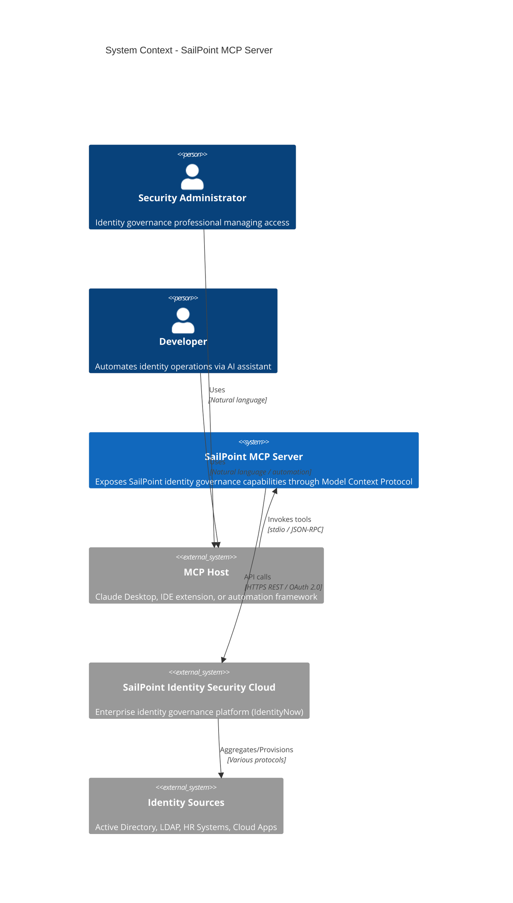

# System Context (C4 Level 1)

This document describes the system context for the SailPoint MCP Server, showing how it fits into the broader enterprise ecosystem and its relationships with external systems.

## System Context Diagram



## Context Narrative

### System Purpose

The SailPoint MCP Server acts as a bridge between AI-powered assistants (MCP hosts) and the SailPoint Identity Security Cloud platform. It translates natural language intentions into structured API operations, enabling:

- **Identity Inquiry**: Search and retrieve identity, account, and entitlement information
- **Access Management**: Request, review, and manage access across enterprise systems
- **Governance Operations**: Execute certification campaigns, manage roles, and enforce SOD policies
- **Automation**: Trigger and monitor workflow executions

### Primary Actors

| Actor | Description | Interaction |
|-------|-------------|-------------|
| **Security Administrator** | Identity governance professional responsible for access reviews, role management, and compliance | Uses AI assistant to query identities, review access, and manage governance tasks |
| **Developer** | Technical user automating identity operations or integrating with CI/CD pipelines | Integrates MCP server into automation workflows |
| **Compliance Auditor** | Reviews access patterns and SOD violations | Queries system through AI assistant for audit reports |

### External Systems

#### MCP Host (Claude Desktop, IDE Extensions)

- **Relationship**: Parent process that spawns and communicates with MCP server
- **Protocol**: stdio transport with JSON-RPC messaging
- **Data Exchanged**: Tool invocations, parameters, and JSON responses
- **Trust Level**: Trusted - hosts the credentials and user context

#### SailPoint Identity Security Cloud

- **Relationship**: Target system providing identity governance capabilities
- **Protocol**: HTTPS REST API v3
- **Authentication**: OAuth 2.0 Client Credentials flow with Personal Access Token
- **Data Exchanged**: Identity records, accounts, entitlements, certifications, roles
- **Trust Level**: External trusted system with delegated permissions

#### Identity Sources (Indirect)

- **Relationship**: Upstream systems that SailPoint aggregates data from
- **Examples**: Active Directory, LDAP, Workday, ServiceNow, cloud applications
- **Protocol**: Managed by SailPoint connectors (not directly accessed)
- **Data Exchanged**: User accounts, group memberships, entitlements

## Data Classifications

| Data Type | Classification | Examples |
|-----------|----------------|----------|
| Identity Attributes | PII | Names, emails, employee IDs |
| Account Credentials | Restricted | Not exposed through MCP |
| Entitlements | Confidential | Application permissions, group memberships |
| Certification Decisions | Audit | Approve/revoke decisions with timestamps |
| SOD Violations | Compliance-Critical | Policy violations, risk scores |

## Integration Points

### Inbound (MCP Protocol)

```
MCP Host --> [stdio] --> MCP Server
                         |
                         +-- tools/list (discovery)
                         +-- tools/call (execution)
```

- **Transport**: Standard input/output streams
- **Message Format**: JSON-RPC 2.0
- **Concurrency**: Sequential request processing
- **Session**: Persistent for lifetime of process

### Outbound (SailPoint API)

```
MCP Server --> [HTTPS] --> SailPoint ISC
                           |
                           +-- /oauth/token (authentication)
                           +-- /v3/* (identity APIs)
```

- **Base URL**: Tenant-specific (e.g., `https://acme.api.identitynow.com`)
- **Authentication**: Bearer token from OAuth 2.0 client credentials
- **Rate Limiting**: Subject to SailPoint API rate limits
- **Timeout**: Default axios timeouts apply

## Environment Context

### Required Configuration

| Variable | Purpose | Example |
|----------|---------|---------|
| `SAILPOINT_BASE_URL` | Tenant API endpoint | `https://acme.api.identitynow.com` |
| `SAILPOINT_CLIENT_ID` | OAuth client identifier | `a1b2c3d4-...` |
| `SAILPOINT_CLIENT_SECRET` | OAuth client secret | `*****` |

### Runtime Requirements

| Requirement | Specification |
|-------------|---------------|
| Node.js | v18+ (ES2022 support) |
| Network | Outbound HTTPS to SailPoint cloud |
| Memory | Minimal (~50MB baseline) |
| CPU | Minimal (I/O bound operations) |

## Assumptions

1. **MCP Host Trust**: The MCP host is trusted and properly authenticated/authorized
2. **Network Connectivity**: Stable outbound internet access to SailPoint cloud
3. **Credential Management**: Environment variables are securely provisioned
4. **Single Tenant**: Each server instance connects to one SailPoint tenant
5. **API Availability**: SailPoint Identity Security Cloud is available and responsive

## Constraints

1. **No Direct Source Access**: Cannot bypass SailPoint to access identity sources directly
2. **Delegated Permissions**: Limited to the permissions granted to the Personal Access Token
3. **Rate Limits**: Subject to SailPoint API rate limiting policies
4. **Read-Heavy Design**: Most operations are read-only; write operations require appropriate PAT scope

## Open Questions and Gaps

1. **Multi-Tenant Support**: Current design supports single tenant per instance. Consider configuration for multi-tenant scenarios.
2. **Offline Capabilities**: No caching layer for offline operation or reduced API calls.
3. **Webhook Integration**: No support for receiving SailPoint event notifications.
4. **Bulk Operations**: No batch/bulk API utilization for large-scale operations.

---

*Next: [Containers](./containers.md) - C4 Level 2 container architecture*
