# Data Flow Architecture

This document describes data flows through the SailPoint MCP Server, including sensitive data paths, trust boundaries, and data transformation points.

## High-Level Data Flow Diagram

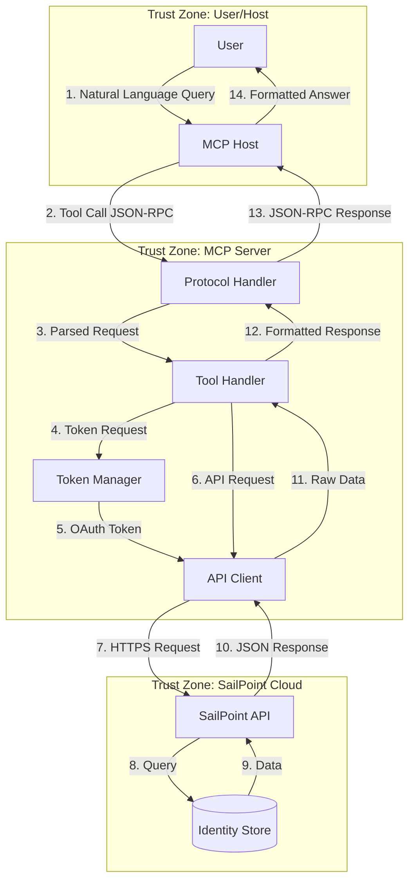

## Data Flow Sequences

### Read Operation: List Identities

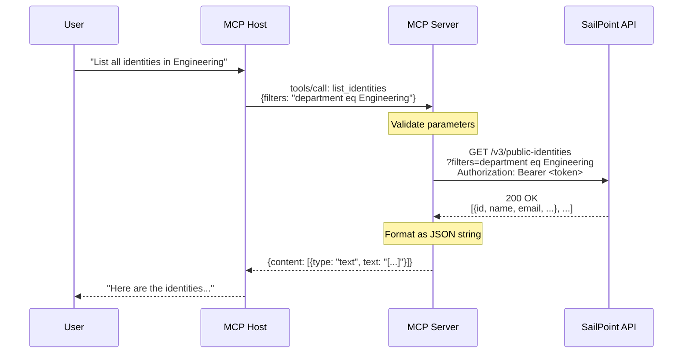

**Data Classification at Each Step**:

| Step | Data | Classification | Handling |
|------|------|----------------|----------|
| 1 | User query | Internal | Plain text |
| 2 | Filter expression | Internal | URL-safe encoding |
| 3 | OAuth token | Credential | In-memory only |
| 4 | API response | PII | Logged minimally |
| 5 | Formatted output | PII | Returned to trusted host |

### Write Operation: Create Access Request

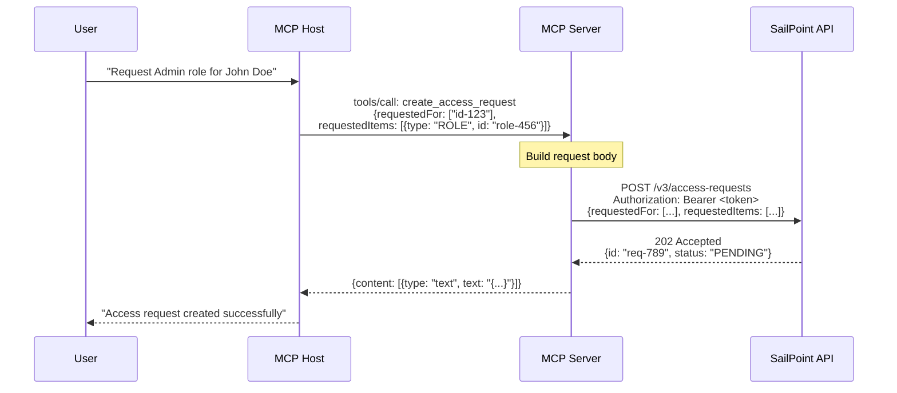

**Audit Trail**:

| Event | Actor | Action | Target |
|-------|-------|--------|--------|
| Request Created | MCP Server (PAT owner) | create_access_request | John Doe (id-123) |

### Authentication Flow: OAuth Token

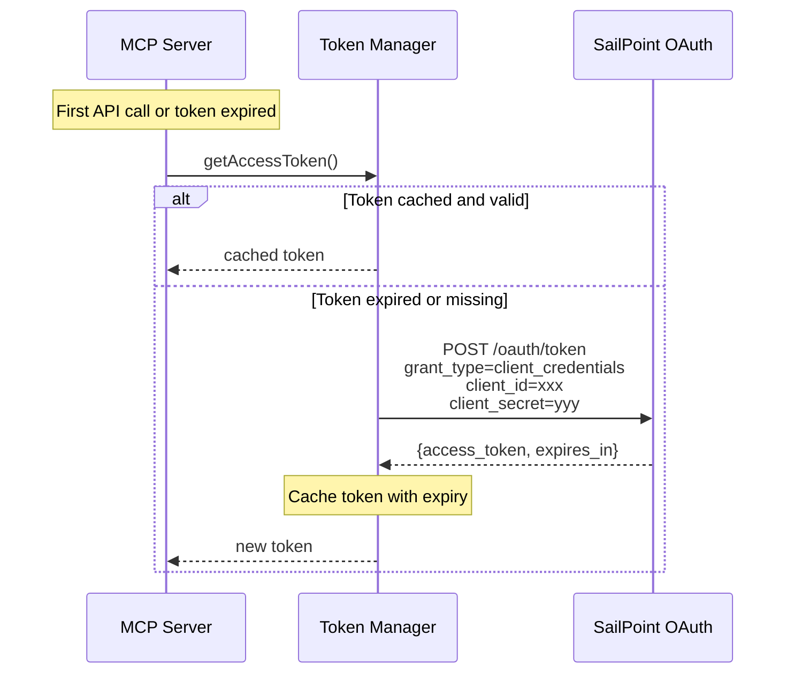

**Credential Handling**:

| Credential | Storage | Transmission | Exposure |
|------------|---------|--------------|----------|
| Client ID | Environment variable | HTTPS POST body | Never logged |
| Client Secret | Environment variable | HTTPS POST body | Never logged |
| Access Token | In-memory variable | HTTPS header | Never logged |

## Trust Boundaries

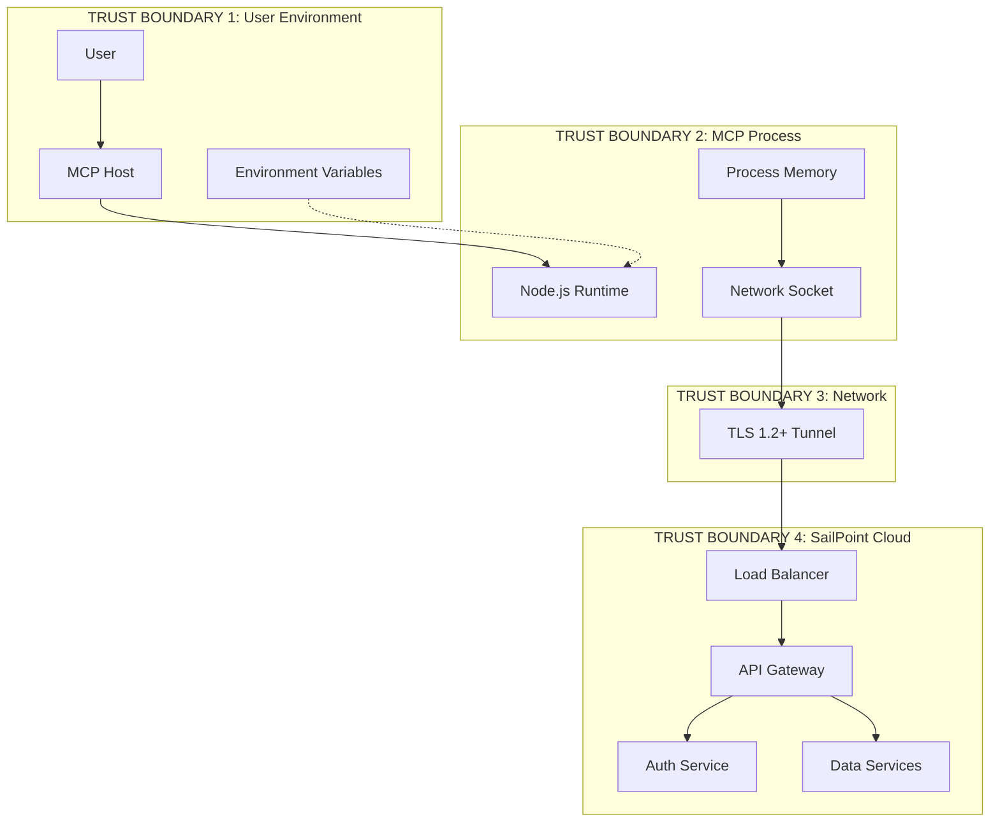

### Boundary Analysis

| Boundary | Entry Point | Validation | Risk |
|----------|-------------|------------|------|
| **User -> Host** | Natural language | Host-dependent | Prompt injection |
| **Host -> MCP** | JSON-RPC stdio | Schema validation | Malformed requests |
| **MCP -> Network** | HTTPS | TLS certificate | MITM (mitigated) |
| **Network -> SailPoint** | API Gateway | OAuth + RBAC | Token theft |

## Sensitive Data Inventory

### Data Categories

| Category | Examples | Classification | Retention |
|----------|----------|----------------|-----------|
| **Identity Attributes** | name, email, department | PII | Transient (not stored) |
| **Account Details** | username, status, source | Confidential | Transient |
| **Entitlements** | permissions, group memberships | Confidential | Transient |
| **Credentials** | client_id, client_secret, tokens | Secret | Memory only |
| **Certification Decisions** | approve/revoke, reviewer, timestamp | Audit | Not stored locally |
| **SOD Violations** | conflicting access, risk score | Compliance | Not stored locally |

### Data Path Analysis

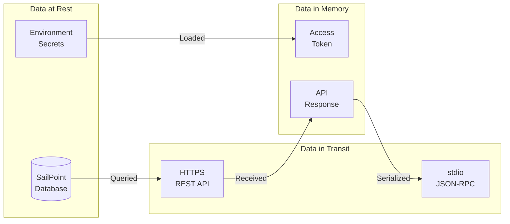

### Sensitive Data Protections

| Data | Protection | Implementation |
|------|------------|----------------|
| Client Secret | Never logged, memory-only | Not in formatError() |
| Access Token | Not persisted, auto-expires | 60s pre-expiry refresh |
| PII in responses | Passed through, not cached | No local storage |
| Audit events | Created in SailPoint | PAT owner recorded |

## Data Transformation Points

### Input Transformation (Host -> SailPoint)

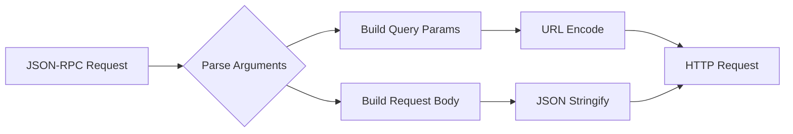

| Stage | Input | Output | Validation |
|-------|-------|--------|------------|
| Parse | JSON-RPC params | JS object | TypeScript types |
| Query Build | args object | Record<string, string> | Implicit |
| Body Build | args object | Structured body | None (trusted input) |
| Encoding | String values | URL-safe strings | axios default |

### Output Transformation (SailPoint -> Host)

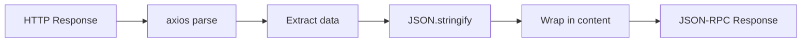

| Stage | Input | Output | Processing |
|-------|-------|--------|------------|
| HTTP Parse | Raw HTTPS response | axios response object | Auto by axios |
| Data Extract | response.data | Raw API payload | Direct access |
| Stringify | JS object | JSON string | Pretty print (2-space) |
| Wrap | JSON string | MCP content block | Standard format |

## Search Data Flow

### Full-Text Search

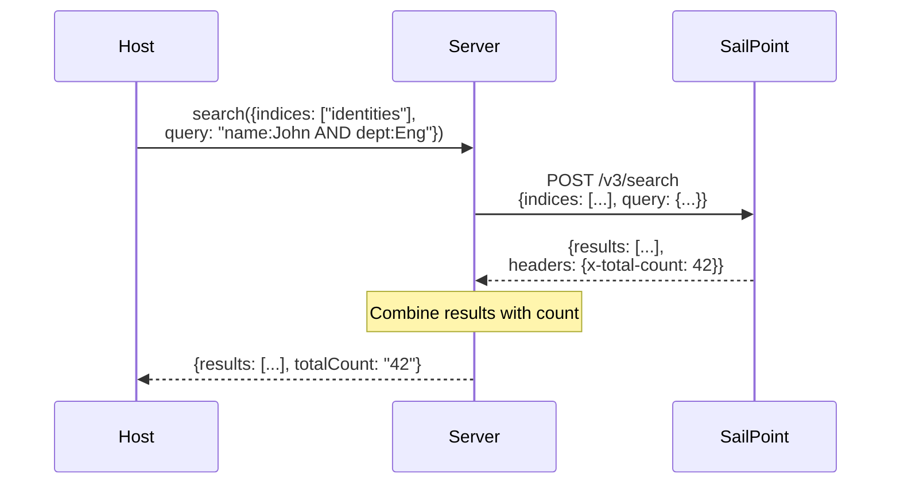

### Aggregate Query

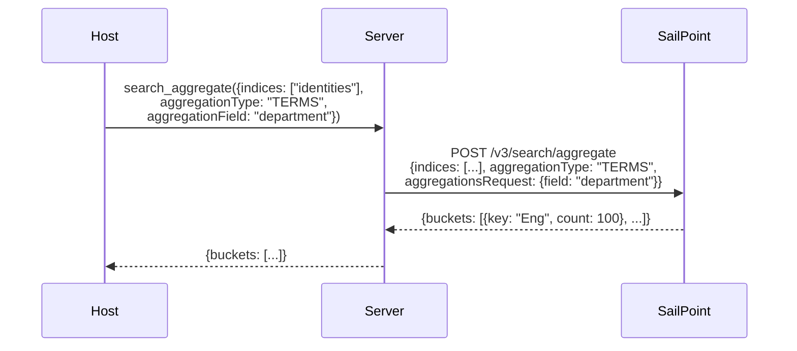

## Error Data Flows

### API Error Handling

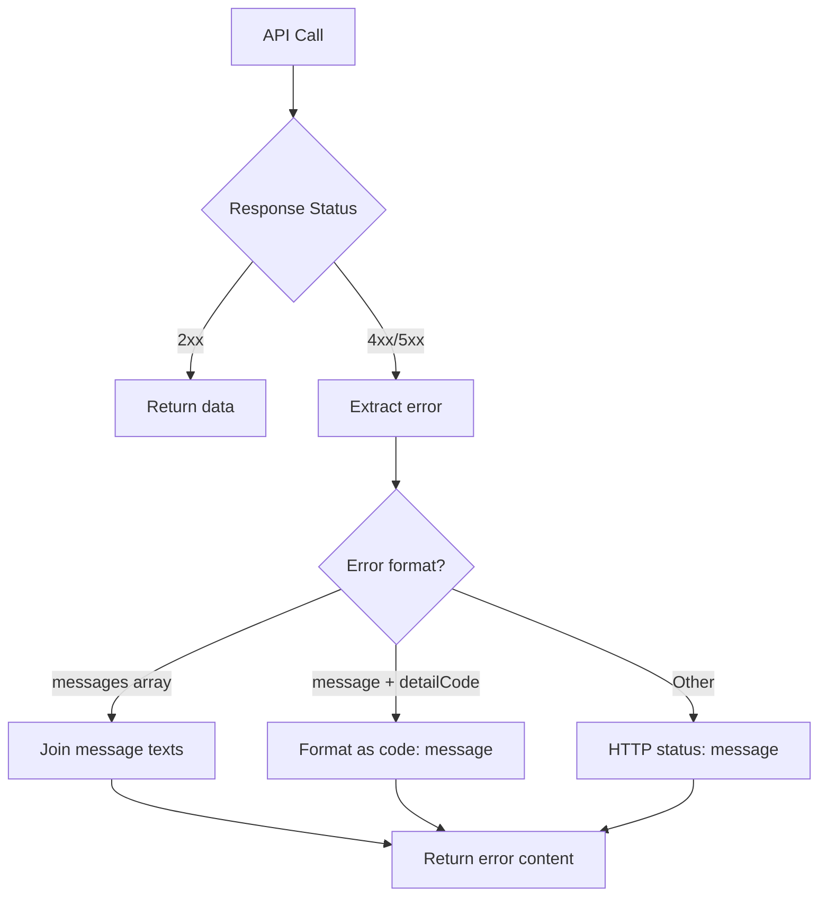

### Error Response Examples

**SailPoint Validation Error**:
```json
{
  "detailCode": "INVALID_FILTER",
  "message": "Filter expression is invalid"
}
```

**MCP Error Response**:
```json
{
  "content": [{
    "type": "text",
    "text": "Error: INVALID_FILTER: Filter expression is invalid"
  }],
  "isError": true
}
```

## Pagination Data Flow

### Manual Pagination

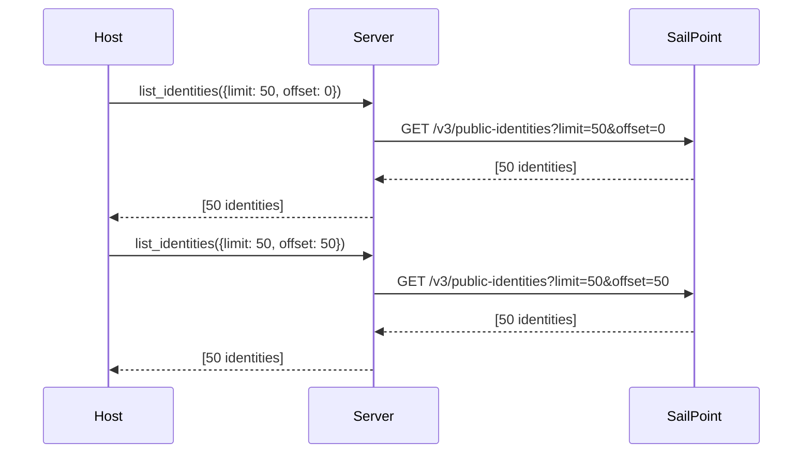

### Search Cursor Pagination

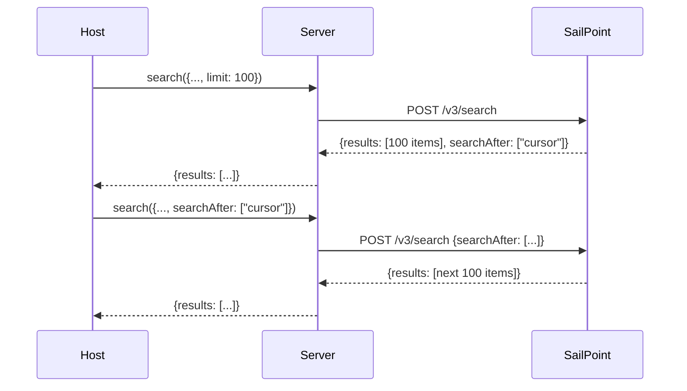

## Open Questions and Gaps

1. **Response Size Limits**: No truncation of large API responses. Could cause memory issues.
2. **Rate Limit Headers**: SailPoint rate limit headers not exposed to caller.
3. **Partial Failure Handling**: No strategy for handling partial failures in multi-item operations.
4. **Data Masking**: No option to mask sensitive fields in responses.
5. **Audit Logging**: No local audit log of operations performed.

---

*Next: [Security](./security.md) - Threat model and security controls*
