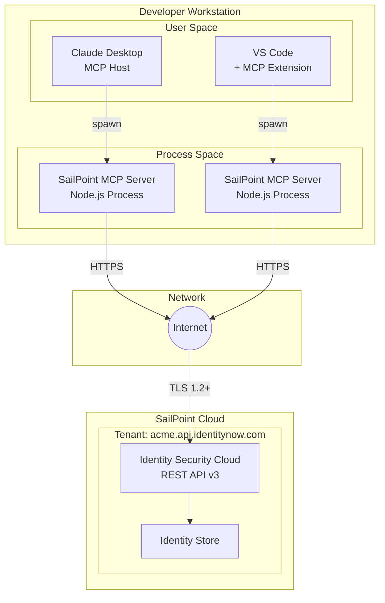
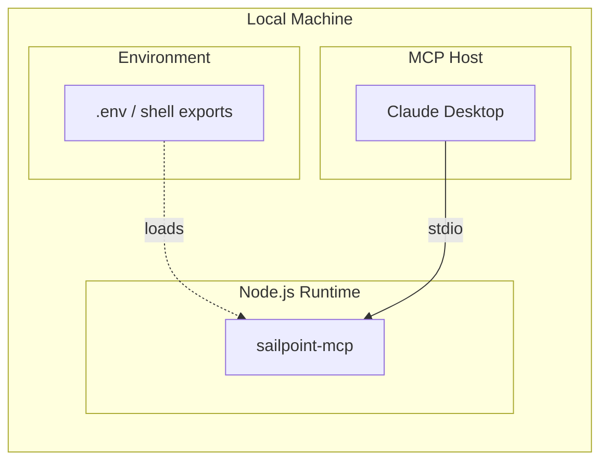
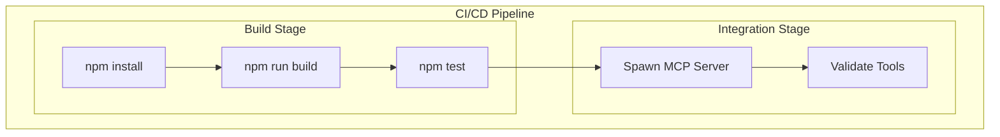
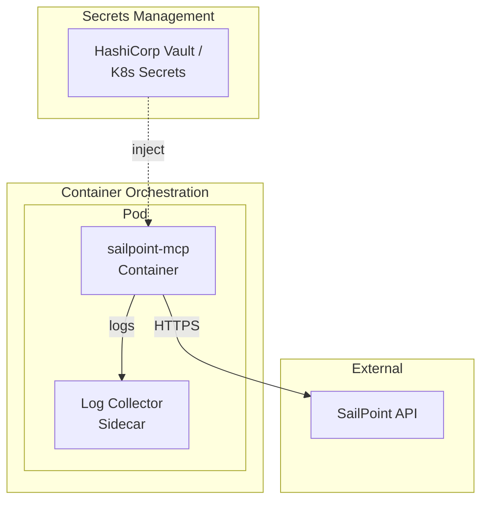
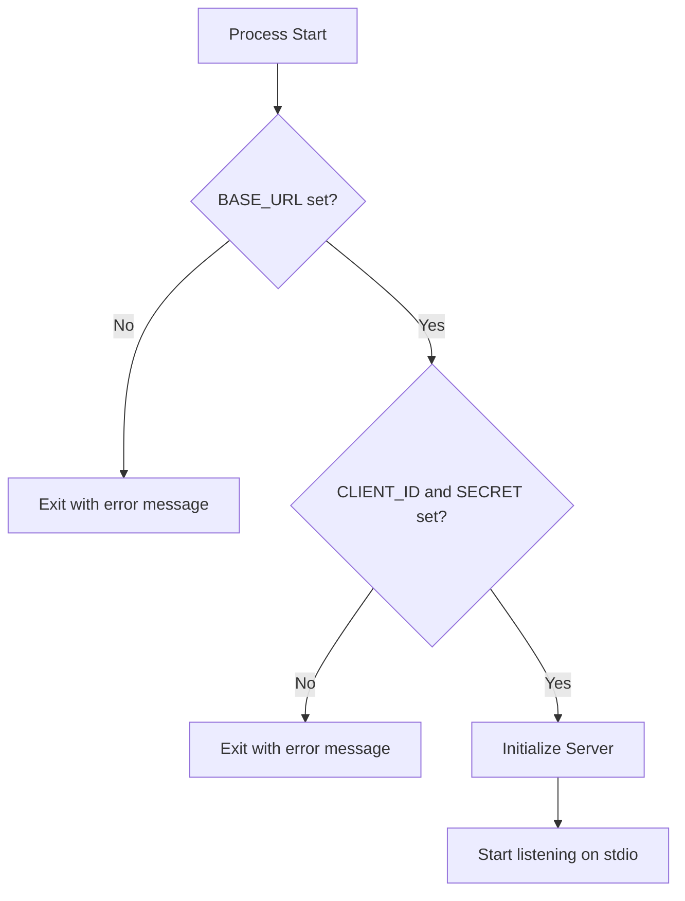

# Deployment Architecture

This document describes deployment patterns, environment configurations, and operational considerations for the SailPoint MCP Server.

## Deployment Diagram



## Supported Environments

### Local Development

The primary deployment model for individual developer use.



**Configuration**:

| Aspect | Specification |
|--------|---------------|
| Runtime | Node.js 18+ |
| Launch | Via MCP host configuration |
| Credentials | Environment variables |
| Networking | Direct internet access |
| Persistence | None (stateless) |

**MCP Host Configuration (Claude Desktop)**:

```json
{
  "mcpServers": {
    "sailpoint": {
      "command": "node",
      "args": ["/path/to/sailpoint-mcp/dist/index.js"],
      "env": {
        "SAILPOINT_BASE_URL": "https://acme.api.identitynow.com",
        "SAILPOINT_CLIENT_ID": "your-client-id",
        "SAILPOINT_CLIENT_SECRET": "your-client-secret"
      }
    }
  }
}
```

### CI/CD Integration

For automated testing and validation pipelines.



**Configuration**:

| Aspect | Specification |
|--------|---------------|
| Runner | GitHub Actions / GitLab CI / Jenkins |
| Node.js | via setup-node action |
| Credentials | CI/CD secrets |
| Network | Outbound HTTPS allowed |

**Example GitHub Actions**:

```yaml
jobs:
  test:
    runs-on: ubuntu-latest
    steps:
      - uses: actions/checkout@v4
      - uses: actions/setup-node@v4
        with:
          node-version: '20'
      - run: npm ci
      - run: npm run build
      - name: Validate MCP Server
        env:
          SAILPOINT_BASE_URL: ${{ secrets.SAILPOINT_BASE_URL }}
          SAILPOINT_CLIENT_ID: ${{ secrets.SAILPOINT_CLIENT_ID }}
          SAILPOINT_CLIENT_SECRET: ${{ secrets.SAILPOINT_CLIENT_SECRET }}
        run: |
          node dist/index.js &
          sleep 2
          # Validation logic here
```

### Container Deployment (Future)

For containerized or server-side deployments.



**Dockerfile (Proposed)**:

```dockerfile
FROM node:20-alpine

WORKDIR /app
COPY package*.json ./
RUN npm ci --production
COPY dist ./dist

USER node
CMD ["node", "dist/index.js"]
```

**Note**: Container deployment requires MCP transport adaptation (e.g., HTTP/SSE instead of stdio).

## Environment Matrix

| Environment | Use Case | Credentials | Network | SailPoint Tenant |
|-------------|----------|-------------|---------|------------------|
| **Local Dev** | Individual development | .env file | Direct internet | Dev/Sandbox tenant |
| **CI/CD** | Automated testing | CI secrets | Runner outbound | Test tenant |
| **Staging** | Integration testing | Vault/Secrets | Corporate VPN | Staging tenant |
| **Production** | Live automation | Vault/Secrets | Restricted egress | Production tenant |

## Configuration Management

### Environment Variables

| Variable | Required | Description | Example |
|----------|----------|-------------|---------|
| `SAILPOINT_BASE_URL` | Yes | Tenant API base URL | `https://acme.api.identitynow.com` |
| `SAILPOINT_CLIENT_ID` | Yes | OAuth client ID | `abc123-def456-...` |
| `SAILPOINT_CLIENT_SECRET` | Yes | OAuth client secret | `secret-value` |

### Validation at Startup



### Secret Management Patterns

| Pattern | Use Case | Implementation |
|---------|----------|----------------|
| **Environment Variables** | Local dev | Shell exports, .env files |
| **MCP Host Config** | Claude Desktop | JSON config with env block |
| **CI Secrets** | Pipelines | GitHub/GitLab secrets |
| **Vault Injection** | Enterprise | HashiCorp Vault agent |
| **K8s Secrets** | Kubernetes | Secret volume mounts |

**Security Considerations**:

- Never commit credentials to version control
- Use least-privilege PAT scopes
- Rotate secrets periodically
- Monitor token usage in SailPoint audit logs

## Network Requirements

### Outbound Connections

| Destination | Port | Protocol | Purpose |
|-------------|------|----------|---------|
| `*.api.identitynow.com` | 443 | HTTPS | SailPoint API |
| `*.identitynow.com` | 443 | HTTPS | OAuth token endpoint |

### Firewall Rules

```
ALLOW OUTBOUND TCP 443 TO *.api.identitynow.com
ALLOW OUTBOUND TCP 443 TO *.identitynow.com
```

### Proxy Configuration

If operating behind a corporate proxy:

```bash
export HTTP_PROXY=http://proxy.corp.example.com:8080
export HTTPS_PROXY=http://proxy.corp.example.com:8080
export NO_PROXY=localhost,127.0.0.1
```

**Note**: Axios respects standard proxy environment variables.

## Operational Considerations

### Monitoring

| Metric | Source | Action |
|--------|--------|--------|
| Process alive | MCP host | Restart if dead |
| API errors | stderr output | Alert on repeated failures |
| Token refresh failures | stderr output | Check credentials |
| Memory usage | OS metrics | Investigate leaks |

### Logging

Current logging is minimal (stderr only):

```typescript
console.error("SailPoint MCP Server running on stdio");
console.error("Error:", errorMessage);
```

**Proposed Enhancement**:

```typescript
// Structured logging for production
logger.info({ event: "server_start", version: "1.0.0" });
logger.error({ event: "api_error", tool: name, error: message });
```

### Health Checks

**Current State**: No health check mechanism.

**Proposed Implementation**:

```typescript
// Liveness: Process is running
// Readiness: Can authenticate to SailPoint

async function healthCheck(): Promise<boolean> {
  try {
    await getAccessToken();
    return true;
  } catch {
    return false;
  }
}
```

### Graceful Shutdown

**Current State**: No signal handling.

**Proposed Implementation**:

```typescript
process.on('SIGTERM', async () => {
  console.error('Received SIGTERM, shutting down...');
  await server.close();
  process.exit(0);
});
```

## Deployment Checklist

### Pre-Deployment

- [ ] Node.js 18+ installed
- [ ] Network access to SailPoint API verified
- [ ] Personal Access Token created with required scopes
- [ ] Environment variables configured
- [ ] MCP host configuration prepared

### Post-Deployment

- [ ] Server starts without errors
- [ ] Tools list successfully returned
- [ ] Sample API call succeeds (e.g., list_identities)
- [ ] Error handling verified (e.g., invalid credentials)

### Production Readiness

- [ ] Secrets stored securely (not in code/config files)
- [ ] Logging configured for operations
- [ ] Monitoring in place
- [ ] Runbook documented
- [ ] Incident response plan established

## Open Questions and Gaps

1. **HTTP Transport**: Current stdio transport limits deployment to local process spawning. SSE/WebSocket transport needed for server deployments.
2. **High Availability**: No clustering or failover capability.
3. **Configuration Reload**: No hot-reload of configuration; requires restart.
4. **Metrics Export**: No Prometheus/StatsD metrics endpoint.
5. **Distributed Tracing**: No OpenTelemetry integration.

---

*Next: [Data Flows](./data-flows.md) - Data flow diagrams and sensitive data paths*
