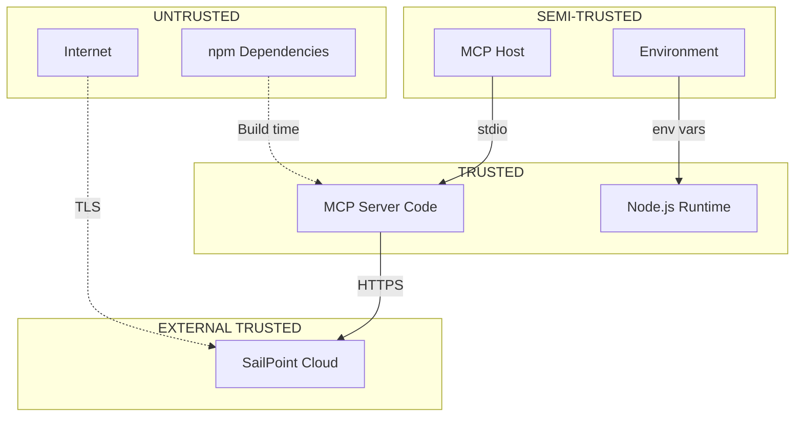
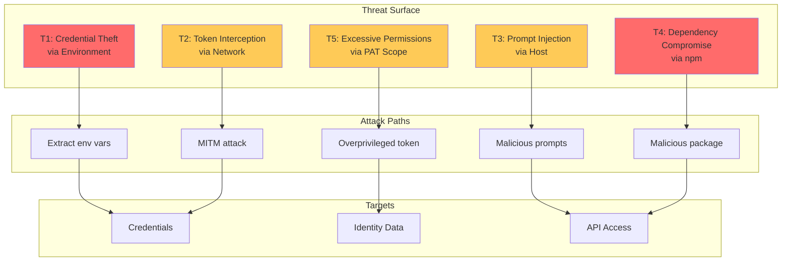
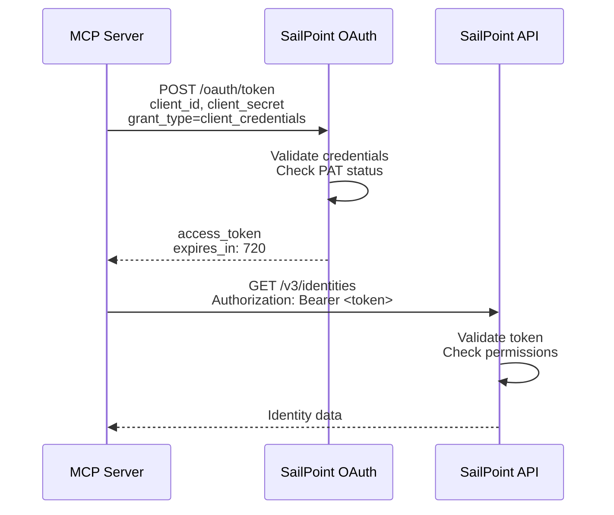
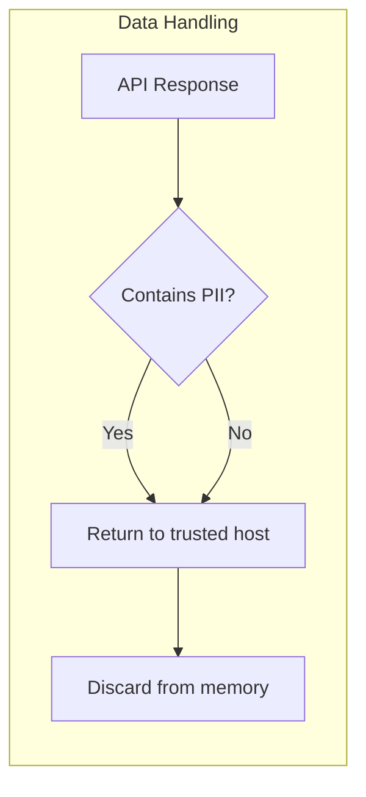

# Security Architecture

This document provides a comprehensive security analysis of the SailPoint MCP Server, including threat modeling, security controls, and recommendations.

## Threat Model Summary

### Assets

| Asset | Description | Value | Sensitivity |
|-------|-------------|-------|-------------|
| **Identity Data** | Names, emails, employee info | High | PII |
| **Access Information** | Roles, entitlements, permissions | Critical | Confidential |
| **Authentication Credentials** | Client ID/Secret, OAuth tokens | Critical | Secret |
| **Audit Trail** | Access decisions, changes | High | Compliance |
| **SailPoint Tenant Access** | API access to governance platform | Critical | Privileged |

### Adversary Profiles

| Adversary | Motivation | Capability | Target |
|-----------|------------|------------|--------|
| **Malicious Insider** | Data theft, sabotage | High (authenticated) | Identity data, access grants |
| **External Attacker** | Credential theft, privilege escalation | Medium | Credentials, API access |
| **Prompt Injection** | Unauthorized operations | Low-Medium | Tool execution flow |
| **Supply Chain** | Code compromise | High (if successful) | Dependencies, build |

### Trust Boundaries



## Threat Analysis (STRIDE)

### Spoofing

| Threat | Description | Likelihood | Impact | Mitigation |
|--------|-------------|------------|--------|------------|
| Token Theft | Stolen OAuth token used to impersonate server | Medium | Critical | Token expiry (12 min), TLS, memory-only storage |
| Credential Theft | Client secret extracted from environment | Medium | Critical | Secure secret management, limited PAT scope |
| Man-in-the-Middle | Intercept API communication | Low | Critical | TLS 1.2+, certificate validation |

### Tampering

| Threat | Description | Likelihood | Impact | Mitigation |
|--------|-------------|------------|--------|------------|
| Request Manipulation | Modify tool parameters in transit | Low | High | stdio pipe (local), JSON-RPC integrity |
| Response Manipulation | Alter API responses | Very Low | High | TLS, SailPoint response signing (if available) |
| Code Tampering | Modify server code | Low | Critical | Code signing, integrity checks (not implemented) |

### Repudiation

| Threat | Description | Likelihood | Impact | Mitigation |
|--------|-------------|------------|--------|------------|
| Unauthorized Actions | Deny performing operations | Medium | Medium | SailPoint audit logs attribute to PAT owner |
| Log Tampering | Alter local logs | Low | Low | No persistent local logs (by design) |

### Information Disclosure

| Threat | Description | Likelihood | Impact | Mitigation |
|--------|-------------|------------|--------|------------|
| PII Exposure | Identity data leaked | Medium | High | No persistent storage, transient processing |
| Credential Logging | Secrets in error messages | Low | Critical | formatError() excludes credentials |
| Memory Dump | Extract data from process memory | Low | High | Token expiry limits window |

### Denial of Service

| Threat | Description | Likelihood | Impact | Mitigation |
|--------|-------------|------------|--------|------------|
| API Rate Limiting | Exhaust SailPoint rate limits | Medium | Medium | No mitigation (inherent to design) |
| Resource Exhaustion | Memory/CPU exhaustion | Low | Low | Node.js single-threaded, process isolation |

### Elevation of Privilege

| Threat | Description | Likelihood | Impact | Mitigation |
|--------|-------------|------------|--------|------------|
| PAT Scope Abuse | Access beyond intended permissions | Medium | High | Least-privilege PAT configuration |
| Tool Injection | Execute unintended tools | Low | High | Fixed tool set, no dynamic loading |

## Threat Model Diagram



## Security Controls

### Authentication and Authorization

#### OAuth 2.0 Client Credentials Flow



**Control Assessment**:

| Control | Implementation | Status |
|---------|----------------|--------|
| Credential validation | SailPoint OAuth | External |
| Token expiration | 12 minutes default | Implemented |
| Pre-expiry refresh | 60 second buffer | Implemented |
| Token caching | In-memory only | Implemented |
| Credential logging | Excluded from errors | Implemented |

#### Personal Access Token (PAT) Scopes

**Recommended Minimum Scopes**:

| Scope | Operations | Justification |
|-------|------------|---------------|
| `idn:accounts:read` | list_accounts, get_account | Account visibility |
| `idn:identities:read` | list_identities, get_identity | Identity visibility |
| `idn:access-profiles:read` | list_access_profiles | Access profile visibility |
| `idn:roles:read` | list_roles, get_role | Role visibility |
| `idn:certifications:read` | list_certifications | Certification visibility |
| `idn:sources:read` | list_sources | Source visibility |
| `idn:workflows:read` | list_workflows | Workflow visibility |

**Additional Scopes for Write Operations**:

| Scope | Operations | Risk |
|-------|------------|------|
| `idn:access-profiles:manage` | create_access_profile | Medium |
| `idn:roles:manage` | create_role | Medium |
| `idn:access-requests:manage` | create_access_request | High |
| `idn:accounts:manage` | enable/disable/unlock | High |
| `idn:workflows:manage` | test_workflow | Medium |

### Data Protection

#### Encryption in Transit

| Connection | Protocol | Certificate Validation |
|------------|----------|------------------------|
| MCP Server -> SailPoint | TLS 1.2+ | Default Node.js CA bundle |
| MCP Host -> Server | N/A (stdio) | Process isolation |

**Current State**: TLS enabled by default via axios/Node.js HTTPS.

**Recommendation**: Consider certificate pinning for enhanced MITM protection.

#### Encryption at Rest

| Data | Storage | Encryption |
|------|---------|------------|
| Credentials | Environment variables | Host OS responsibility |
| Tokens | Process memory | None (volatile) |
| Responses | Process memory | None (transient) |

**No persistent storage** - data is processed in memory and discarded.

#### Data Classification Handling



| Classification | Handling | Retention |
|----------------|----------|-----------|
| PII | Pass through, no logging | Transient |
| Confidential | Pass through, no logging | Transient |
| Secret | Memory-only, never logged | Session lifetime |

### Supply Chain Security

#### Dependency Analysis

**Direct Dependencies**:

| Package | Purpose | Risk Level |
|---------|---------|------------|
| `@modelcontextprotocol/sdk` | MCP protocol | Low (Anthropic) |
| `axios` | HTTP client | Low (widely used) |
| `typescript` | Build toolchain | Low (dev only) |
| `@types/node` | Type definitions | Low (dev only) |

**Recommended Controls**:

| Control | Implementation | Status |
|---------|----------------|--------|
| Lock file | package-lock.json | Implemented |
| Audit | `npm audit` | Manual |
| SBOM | Not generated | Recommended |
| Signature verification | Not implemented | Recommended |

### Input Validation

#### Current State

| Input | Validation | Gap |
|-------|------------|-----|
| Tool name | Switch statement match | Secure |
| Tool arguments | TypeScript types (build time) | No runtime validation |
| API responses | None | Trusted source |

**Recommendations**:

1. Add runtime validation for tool arguments using Zod or similar
2. Validate API response structure before processing
3. Sanitize filter expressions to prevent injection

### Error Handling

#### Error Message Security

```typescript
function formatError(error: unknown): string {
  if (axios.isAxiosError(error)) {
    // Extract safe error details
    // Never include: client_id, client_secret, access_token
    const data = axiosError.response?.data;
    if (data?.messages) return data.messages.map(m => m.text).join("; ");
    if (data?.message) return `${data.detailCode}: ${data.message}`;
    return `HTTP ${status}: ${message}`;
  }
  return String(error);
}
```

**Security Properties**:

- Credentials never included in error messages
- SailPoint error details preserved for debugging
- Generic fallback for unknown errors

### Logging and Monitoring

#### Current Logging

| Log Type | Destination | Content |
|----------|-------------|---------|
| Startup | stderr | Server ready message |
| Errors | stderr | Formatted error messages |
| Operations | None | Not logged |

#### Audit Trail

| Event | Logged By | Details |
|-------|-----------|---------|
| API calls | SailPoint | PAT owner, timestamp, endpoint, response |
| Access decisions | SailPoint | Certification actions, access grants |
| Token requests | SailPoint | OAuth token issuance |

**Recommendations**:

1. Add structured logging for operations
2. Include correlation IDs for request tracing
3. Log tool invocations (without sensitive parameters)

### Hardening Recommendations

#### Process Security

| Control | Recommendation | Priority |
|---------|----------------|----------|
| Drop privileges | Run as non-root user | High |
| Resource limits | Set memory/CPU limits | Medium |
| Sandboxing | Consider seccomp/AppArmor | Low |

#### Network Security

| Control | Recommendation | Priority |
|---------|----------------|----------|
| Egress filtering | Allow only SailPoint domains | High |
| Certificate pinning | Pin SailPoint certificates | Medium |
| Rate limiting | Implement client-side rate limiting | Medium |

#### Secret Management

| Control | Recommendation | Priority |
|---------|----------------|----------|
| Vault integration | Use HashiCorp Vault or similar | High |
| Secret rotation | Rotate PAT periodically | Medium |
| Least privilege | Minimize PAT scopes | High |

## Security Checklist

### Development

- [ ] Dependencies audited with `npm audit`
- [ ] No hardcoded credentials in code
- [ ] Error messages reviewed for information leakage
- [ ] TypeScript strict mode enabled

### Deployment

- [ ] Secrets stored securely (not in code/config files)
- [ ] PAT scopes follow least-privilege principle
- [ ] Network egress restricted to SailPoint domains
- [ ] Process runs as non-root user

### Operations

- [ ] PAT rotation schedule established
- [ ] SailPoint audit logs monitored
- [ ] Incident response plan documented
- [ ] Security contact information available

## Compliance Considerations

### SOC 2

| Control | Applicability | Implementation |
|---------|---------------|----------------|
| Access Control | Yes | OAuth + PAT scopes |
| Encryption | Yes | TLS in transit |
| Logging | Partial | SailPoint audit logs |
| Monitoring | Partial | Host-dependent |

### GDPR

| Requirement | Applicability | Implementation |
|-------------|---------------|----------------|
| Lawful basis | Yes | PAT owner consent |
| Data minimization | Yes | Query-specific retrieval |
| Right to access | N/A | Managed by SailPoint |
| Data portability | N/A | Managed by SailPoint |

## Open Questions and Gaps

1. **Runtime Validation**: No runtime validation of tool parameters. Malformed input could cause unexpected behavior.
2. **Certificate Pinning**: Not implemented. Relies on system CA bundle.
3. **Secret Rotation**: No built-in secret rotation mechanism.
4. **Rate Limiting**: No client-side rate limiting to prevent API abuse.
5. **Security Headers**: N/A for stdio transport, but relevant for future HTTP transport.
6. **SBOM Generation**: No Software Bill of Materials generated.
7. **Vulnerability Scanning**: No automated SAST/DAST integration.

---

*Next: [TOGAF Mapping](./togaf-mapping.md) - TOGAF-aligned architecture views*
