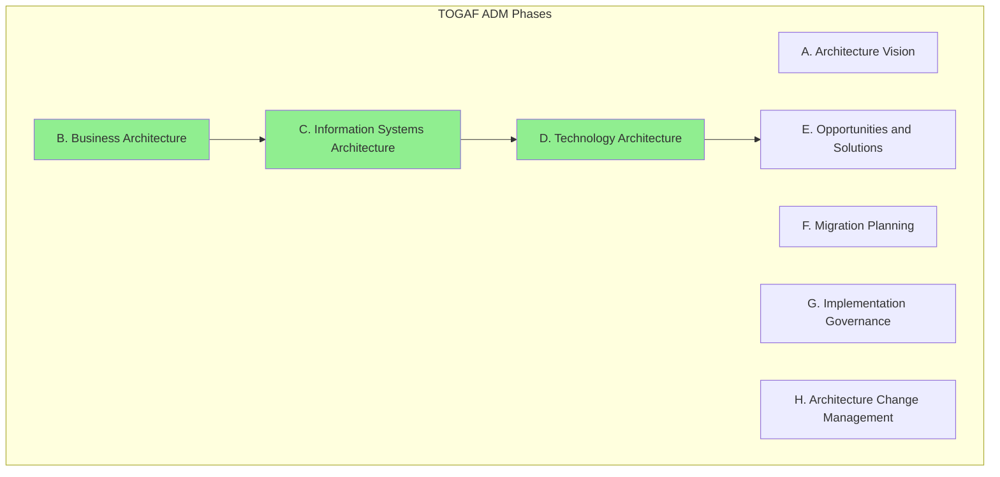
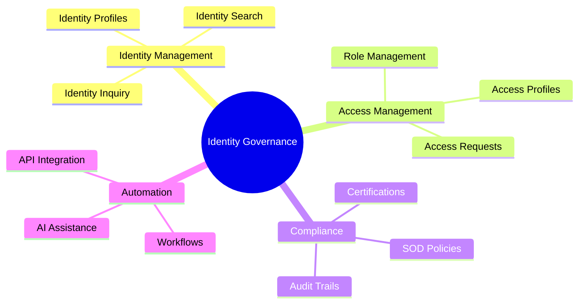
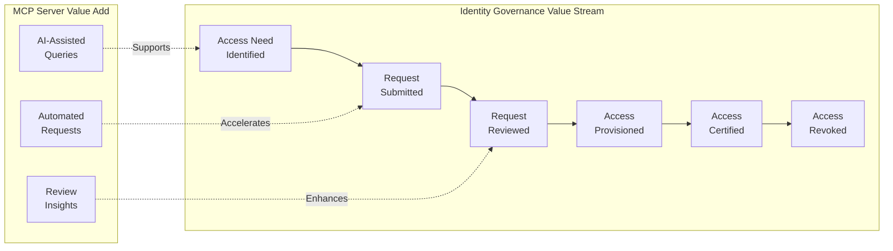
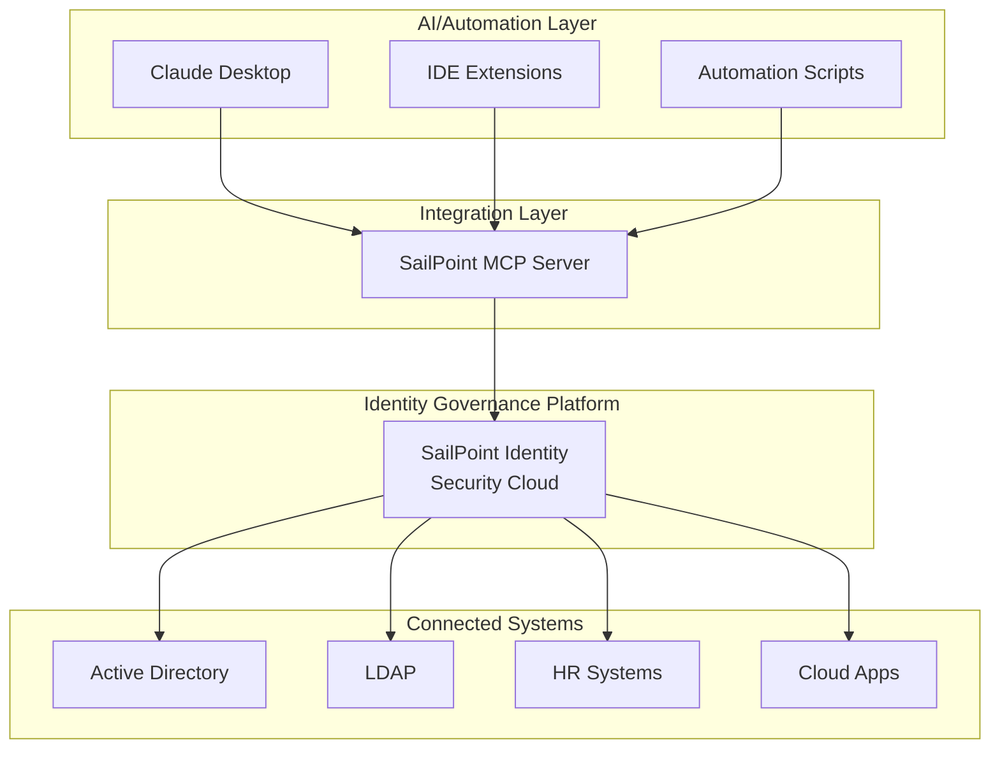
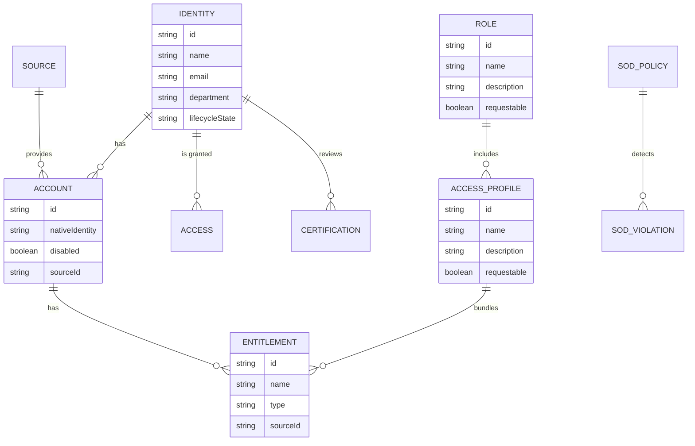
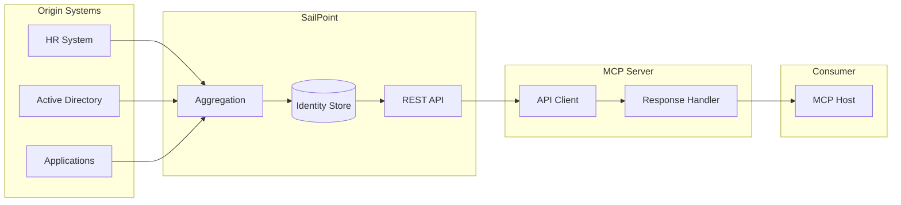
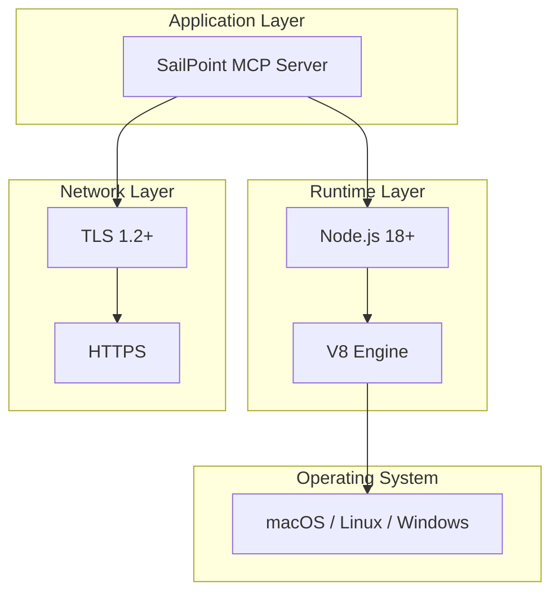
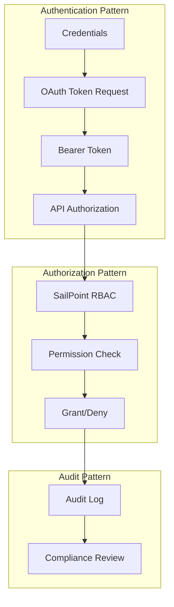

# TOGAF Architecture Mapping

This document maps the SailPoint MCP Server architecture to TOGAF (The Open Group Architecture Framework) views and building blocks.

## TOGAF ADM Context

The SailPoint MCP Server addresses phases B, C, and D of the TOGAF Architecture Development Method (ADM).



## Business Architecture (Phase B)

### Business Context

#### Stakeholders

| Stakeholder | Concerns | Influence |
|-------------|----------|-----------|
| **Security Administrators** | Efficient identity governance, compliance automation | High |
| **Developers** | API integration, automation capabilities | Medium |
| **Compliance Officers** | Audit trails, SOD enforcement | High |
| **IT Operations** | Deployment simplicity, reliability | Medium |
| **End Users** | Self-service access requests | Low (indirect) |

#### Business Drivers

| Driver | Description | Metric |
|--------|-------------|--------|
| **Operational Efficiency** | Reduce manual identity governance tasks | Time saved per operation |
| **Compliance Automation** | Automate access reviews and SOD checks | Audit completion rate |
| **Developer Productivity** | Enable AI-assisted identity operations | Developer satisfaction |
| **Risk Reduction** | Faster response to access issues | Mean time to remediate |

#### Business Constraints

| Constraint | Description | Impact |
|------------|-------------|--------|
| **Regulatory Compliance** | SOX, GDPR, industry regulations | Audit requirements |
| **SailPoint Licensing** | API rate limits, feature availability | Throughput limits |
| **Security Policies** | Credential management, least privilege | Deployment complexity |

### Business Capabilities



### Value Stream



## Application Architecture (Phase C - Applications)

### Application Building Blocks (ABBs)

| ABB | Description | Pattern |
|-----|-------------|---------|
| **Protocol Handler** | MCP protocol implementation | Adapter |
| **Tool Registry** | Tool definition and discovery | Registry |
| **Tool Executor** | Tool dispatch and execution | Command |
| **API Client** | SailPoint API communication | Client |
| **Token Manager** | OAuth token lifecycle | Cache |
| **Error Handler** | Error formatting and response | Handler |

### Application Landscape



### Application Interfaces

| Interface | Type | Protocol | Description |
|-----------|------|----------|-------------|
| MCP Inbound | Synchronous | JSON-RPC/stdio | Tool invocation |
| SailPoint API | Synchronous | REST/HTTPS | Identity operations |
| OAuth | Synchronous | HTTPS | Token acquisition |

### Service Contracts

#### MCP Tool Contract

```typescript
interface MCPToolContract {
  // Discovery
  listTools(): Tool[];

  // Execution
  callTool(name: string, args: object): {
    content: { type: string; text: string }[];
    isError?: boolean;
  };
}
```

#### SailPoint API Contract

```typescript
interface SailPointAPIContract {
  // Identity Operations
  listIdentities(params: QueryParams): Identity[];
  getIdentity(id: string): Identity;

  // Account Operations
  listAccounts(params: QueryParams): Account[];
  enableAccount(id: string): void;
  disableAccount(id: string): void;

  // Access Management
  createAccessRequest(request: AccessRequest): RequestResult;
  createRole(role: Role): Role;

  // Search
  search(query: SearchQuery): SearchResult;
}
```

## Data Architecture (Phase C - Data)

### Data Entities



### Data Classification

| Entity | Classification | Sensitivity | Retention |
|--------|----------------|-------------|-----------|
| Identity | PII | High | Transient |
| Account | Confidential | High | Transient |
| Entitlement | Confidential | Medium | Transient |
| Certification | Audit | High | Transient |
| SOD Violation | Compliance | Critical | Transient |

### Data Lineage



### Data Quality

| Dimension | Source | MCP Server Role |
|-----------|--------|-----------------|
| Accuracy | SailPoint | Pass-through |
| Completeness | SailPoint | No transformation |
| Timeliness | Real-time API | Fresh on each call |
| Consistency | SailPoint | Preserved |

## Technology Architecture (Phase D)

### Technology Building Blocks (TBBs)

| TBB | Implementation | Category |
|-----|----------------|----------|
| **Runtime** | Node.js 18+ | Platform |
| **Language** | TypeScript 5.3+ | Development |
| **Protocol** | MCP SDK 1.0 | Integration |
| **HTTP Client** | Axios 1.6+ | Integration |
| **Authentication** | OAuth 2.0 | Security |
| **Transport** | TLS 1.2+ | Security |

### Technology Standards

| Standard | Application | Compliance |
|----------|-------------|------------|
| ES2022 | JavaScript runtime | Full |
| JSON-RPC 2.0 | MCP protocol | Full |
| OAuth 2.0 | Authentication | Client Credentials |
| REST | API style | Full |
| TLS 1.2+ | Transport security | Full |

### Platform Stack



### Infrastructure Requirements

| Component | Requirement | Notes |
|-----------|-------------|-------|
| CPU | Minimal (I/O bound) | Single thread sufficient |
| Memory | 50-100 MB | Node.js baseline |
| Storage | 50 MB | Code and dependencies |
| Network | Outbound HTTPS | SailPoint API access |

## Security Architecture

### Security Building Blocks

| SBB | Implementation | Function |
|-----|----------------|----------|
| **Identity** | OAuth Client ID | Service identity |
| **Credential** | Client Secret | Authentication |
| **Token** | Bearer Token | Authorization |
| **Encryption** | TLS 1.2+ | Transport security |
| **Audit** | SailPoint Logs | Accountability |

### Security Patterns



## Architecture Principles

### Business Principles

| Principle | Statement | Rationale |
|-----------|-----------|-----------|
| **Business Alignment** | Technology enables identity governance efficiency | Core business value |
| **Compliance First** | All operations must be auditable | Regulatory requirement |
| **User Empowerment** | Enable self-service through AI | Reduce support burden |

### Application Principles

| Principle | Statement | Rationale |
|-----------|-----------|-----------|
| **Single Responsibility** | MCP server focuses on protocol translation | Maintainability |
| **Stateless Operation** | No persistent state in MCP server | Scalability, simplicity |
| **Fail Fast** | Validate configuration at startup | Early error detection |

### Data Principles

| Principle | Statement | Rationale |
|-----------|-----------|-----------|
| **Data Minimization** | Only fetch required data | Privacy, performance |
| **No Persistent Storage** | Data processed transiently | Security, compliance |
| **Preserve Fidelity** | Pass-through without transformation | Accuracy |

### Technology Principles

| Principle | Statement | Rationale |
|-----------|-----------|-----------|
| **Standard Protocols** | Use MCP, OAuth, REST standards | Interoperability |
| **Minimal Dependencies** | Limit external dependencies | Security, maintenance |
| **Secure by Default** | TLS, token expiry, least privilege | Security posture |

## Architecture Requirements

### Functional Requirements

| Requirement | Priority | Status |
|-------------|----------|--------|
| List identities and accounts | High | Implemented |
| Manage access profiles and roles | High | Implemented |
| Execute certifications | Medium | Read-only implemented |
| Trigger workflows | Medium | Implemented |
| Search across indices | High | Implemented |
| SOD policy management | Medium | Read-only implemented |

### Non-Functional Requirements

| Requirement | Target | Status |
|-------------|--------|--------|
| Response time | < 5s for typical operations | Met |
| Availability | Dependent on SailPoint SLA | N/A |
| Security | TLS, OAuth, no persistent storage | Met |
| Scalability | Single instance per session | Designed |
| Maintainability | Single TypeScript file | Acceptable |

## Gap Analysis

| Area | Current State | Target State | Gap |
|------|---------------|--------------|-----|
| **Input Validation** | TypeScript types only | Runtime validation | Medium |
| **Error Handling** | Basic formatting | Structured errors | Low |
| **Observability** | stderr logging | Structured logging, metrics | Medium |
| **Testing** | None | Unit + integration tests | High |
| **Documentation** | README + arch docs | API docs, runbook | Medium |

## Roadmap Recommendations

### Phase 1: Stabilization

- Add runtime input validation
- Implement unit tests
- Add structured logging

### Phase 2: Enhancement

- Add retry logic for transient failures
- Implement rate limiting
- Add response caching

### Phase 3: Enterprise Readiness

- HTTP/SSE transport for server deployment
- Metrics and tracing
- High availability patterns

## Open Questions and Gaps

1. **TOGAF Compliance**: This architecture is lightweight; full TOGAF compliance would require more formal artifact management.
2. **Architecture Governance**: No formal architecture governance process defined.
3. **Technology Lifecycle**: Dependency update and deprecation strategy not defined.
4. **Capacity Planning**: No capacity model for high-volume scenarios.

---

*Next: [Decisions](./decisions.md) - Architecture Decision Records*
